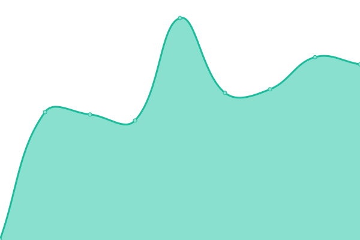

# [📈 Live Status](https://status.interhop.org): <!--live status--> **🟩 All systems operational**

This repository contains the open-source uptime monitor and status page for [aparrot89](https://status.interhop.org), powered by [Upptime](https://github.com/upptime/upptime).

With [Upptime](https://upptime.js.org), you can get your own unlimited and free uptime monitor and status page, powered entirely by a GitHub repository. We use [Issues](https://github.com/aparrot89/interhop-status/issues) as incident reports, [Actions](https://github.com/aparrot89/interhop-status/actions) as uptime monitors, and [Pages](https://status.interhop.org) for the status page.

<!--start: status pages-->
<!-- This summary is generated by Upptime (https://github.com/upptime/upptime) -->
<!-- Do not edit this manually, your changes will be overwritten -->
<!-- prettier-ignore -->
| URL | Status | History | Response Time | Uptime |
| --- | ------ | ------- | ------------- | ------ |
|  [InterHop (Website)](https://interhop.org) | 🟩 Up | [inter-hop-website.yml](https://github.com/aparrot89/interhop-status/commits/HEAD/history/inter-hop-website.yml) | 

 770ms
     
 | 

<a href="https://status.interhop.org/history/inter-hop-website">100.00%</a>
    

|  [Toobib (Website)](https://toobib.org) | 🟩 Up | [toobib-website.yml](https://github.com/aparrot89/interhop-status/commits/HEAD/history/toobib-website.yml) | 

 717ms
     
 | 

<a href="https://status.interhop.org/history/toobib-website">99.26%</a>
    

|  [Element](https://element.interhop.org) | 🟩 Up | [element.yml](https://github.com/aparrot89/interhop-status/commits/HEAD/history/element.yml) | 

 638ms
     
 | 

<a href="https://status.interhop.org/history/element">100.00%</a>
    

|  [Vaultwarden](https://password.interhop.org) | 🟩 Up | [vaultwarden.yml](https://github.com/aparrot89/interhop-status/commits/HEAD/history/vaultwarden.yml) | 

 628ms
     
 | 

<a href="https://status.interhop.org/history/vaultwarden">100.00%</a>
    

|  [Goupile](https://goupile.org) | 🟩 Up | [goupile.yml](https://github.com/aparrot89/interhop-status/commits/HEAD/history/goupile.yml) | 

 607ms
     
 | 

<a href="https://status.interhop.org/history/goupile">100.00%</a>
    

|  [Goupile HDS](https://goupile.hds.interhop.org) | 🟩 Up | [goupile-hds.yml](https://github.com/aparrot89/interhop-status/commits/HEAD/history/goupile-hds.yml) | 

 539ms
     
 | 

<a href="https://status.interhop.org/history/goupile-hds">100.00%</a>
    

|  [Linkr](https://linkr.interhop.org) | 🟩 Up | [linkr.yml](https://github.com/aparrot89/interhop-status/commits/HEAD/history/linkr.yml) | 

 653ms
     
 | 

<a href="https://status.interhop.org/history/linkr">100.00%</a>
    

|  [Cryptpad](https://cpad.interhop.org) | 🟩 Up | [cryptpad.yml](https://github.com/aparrot89/interhop-status/commits/HEAD/history/cryptpad.yml) | 

 547ms
     
 | 

<a href="https://status.interhop.org/history/cryptpad">100.00%</a>
    

|  [Cryptpad HDS](https://cryptpad.hds.interhop.org) | 🟩 Up | [cryptpad-hds.yml](https://github.com/aparrot89/interhop-status/commits/HEAD/history/cryptpad-hds.yml) | 

 466ms
     
 | 

<a href="https://status.interhop.org/history/cryptpad-hds">100.00%</a>
    

|  [HedgeDoc](https://pad.interhop.org) | 🟩 Up | [hedge-doc.yml](https://github.com/aparrot89/interhop-status/commits/HEAD/history/hedge-doc.yml) | 

 630ms
     
 | 

<a href="https://status.interhop.org/history/hedge-doc">100.00%</a>
    

|  [Peertube](https://peertube.interhop.org) | 🟩 Up | [peertube.yml](https://github.com/aparrot89/interhop-status/commits/HEAD/history/peertube.yml) | 

 573ms
     
 | 

<a href="https://status.interhop.org/history/peertube">100.00%</a>
    

<!--end: status pages-->

[**Visit our status website →**](https://status.interhop.org)

## 📄 License

- Powered by: [Upptime](https://github.com/upptime/upptime)
- Code: [MIT](./LICENSE) © [aparrot89](https://status.interhop.org)
- Data in the `./history` directory: [Open Database License](https://opendatacommons.org/licenses/odbl/1-0/)
